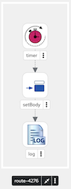

# Camel Timer-Log Example

This project uses Quarkus, the Supersonic Subatomic Java Framework.

If you want to learn more about Quarkus, please visit its website: <https://quarkus.io/>.

## How this was created

First we generated the project's skeleton with `camel-quarkus-yaml-dsl`, `quarkus-container-image-docker` and `quarkus-minikube` enabled. 
This adds Camel YAML DSL, Container build and runtime capabilities. In this case, we'd like to build the 
container image with [Docker](https://quarkus.io/extensions/io.quarkus/quarkus-container-image-docker/) and deploy it to a local [Minikube](https://quarkus.io/extensions/io.quarkus/quarkus-minikube/) cluster.

```shell
mvn io.quarkus:quarkus-maven-plugin:create \
    -DprojectGroupId=org.acme \
    -DprojectArtifactId=timer-log \
    -Dextensions=camel-quarkus-yaml-dsl,quarkus-container-image-docker,quarkus-minikube
```

Next we use [Kaoto](https://kaotoio.github.io/kaoto/) to create a simple route like this ...



## Updating the project

We now use [camel-cloud](https://github.com/tdiesler/camel-cloud-utils) to update the project skeleton
such that it can run the route definition that we created above. 

```shell
camel-cloud add integration ./files/timer-log-route.yaml

2024/07/02 16:22:12 INFO Reading Camel Routes from: ./files/timer-log-route.yaml
2024/07/02 16:22:12 INFO Reading Maven Project from: ./pom.xml
2024/07/02 16:22:12 INFO Group ID: org.acme
2024/07/02 16:22:12 INFO Artifact ID: timer-log
2024/07/02 16:22:12 INFO Version: 1.0.0-SNAPSHOT
2024/07/02 16:22:12 INFO Adding dependency: org.apache.camel.quarkus:camel-quarkus-timer
2024/07/02 16:22:12 INFO Adding dependency: org.apache.camel.quarkus:camel-quarkus-log
2024/07/02 16:22:12 INFO Updated: ./src/main/resources/routes/timer-log-route.yaml
2024/07/02 16:22:12 INFO Updated: ./src/main/resources/application.properties
2024/07/02 16:22:12 INFO Updated: ./pom.xml
```

## Packaging and running the application

The application can be packaged/run using:

```shell
./mvnw clean package && java -jar target/quarkus-app/quarkus-run.jar
```

This should also build the container image

## Running the Docker container

You can run this application in plain Docker like this ...

```shell
docker run --rm examples/timer-log:1.0.0 
```

## Deploy to Minikube 

You can deploy/run this application on Minikube like this ...

```shell
kubectl apply -f ./target/kubernetes/minikube.yml
kubectl logs -f --tail 400  -l app.kubernetes.io/name=timer-log

INFO exec -a "java" java -XX:MaxRAMPercentage=80.0 -XX:+UseParallelGC -XX:MinHeapFreeRatio=10 -XX:MaxHeapFreeRatio=20 -XX:GCTimeRatio=4 -XX:AdaptiveSizePolicyWeight=90 -XX:+ExitOnOutOfMemoryError -Dquarkus.http.host=0.0.0.0 -Djava.util.logging.manager=org.jboss.logmanager.LogManager -cp "." -jar /deployments/quarkus-run.jar 
INFO running in /deployments
__  ____  __  _____   ___  __ ____  ______ 
 --/ __ \/ / / / _ | / _ \/ //_/ / / / __/ 
 -/ /_/ / /_/ / __ |/ , _/ ,< / /_/ /\ \   
--\___\_\____/_/ |_/_/|_/_/|_|\____/___/   
2024-06-26 14:08:48,064 WARN  [io.qua.config] (main) Unrecognized configuration key "quarkus.http.host" was provided; it will be ignored; verify that the dependency extension for this configuration is set or that you did not make a typo
2024-06-26 14:08:48,258 INFO  [org.apa.cam.qua.cor.CamelBootstrapRecorder] (main) Bootstrap runtime: org.apache.camel.quarkus.main.CamelMainRuntime
2024-06-26 14:08:48,259 INFO  [org.apa.cam.mai.MainSupport] (main) Apache Camel (Main) 4.6.0 is starting
2024-06-26 14:08:48,301 INFO  [org.apa.cam.mai.BaseMainSupport] (main) Auto-configuration summary
2024-06-26 14:08:48,301 INFO  [org.apa.cam.mai.BaseMainSupport] (main)     [MicroProfilePropertiesSource] camel.main.routesIncludePattern=routes/*.yaml
2024-06-26 14:08:48,342 INFO  [org.apa.cam.imp.eng.AbstractCamelContext] (main) Apache Camel 4.6.0 (camel-1) is starting
2024-06-26 14:08:48,345 INFO  [org.apa.cam.imp.eng.AbstractCamelContext] (main) Routes startup (total:1)
2024-06-26 14:08:48,346 INFO  [org.apa.cam.imp.eng.AbstractCamelContext] (main)     Started route-4276 (timer://template)
2024-06-26 14:08:48,346 INFO  [org.apa.cam.imp.eng.AbstractCamelContext] (main) Apache Camel 4.6.0 (camel-1) started in 3ms (build:0ms init:0ms start:3ms)
2024-06-26 14:08:48,347 INFO  [io.quarkus] (main) timer-log 1.0.0-SNAPSHOT on JVM (powered by Quarkus 3.12.0) started in 0.405s. 
2024-06-26 14:08:48,347 INFO  [io.quarkus] (main) Profile prod activated. 
2024-06-26 14:08:48,348 INFO  [io.quarkus] (main) Installed features: [camel-core, camel-log, camel-timer, camel-yaml-dsl, cdi, kubernetes, smallrye-context-propagation, vertx]
2024-06-26 14:08:49,361 INFO  [route-4276] (Camel (camel-1) thread #1 - timer://template) "Hello Yaml #1"
2024-06-26 14:08:50,348 INFO  [route-4276] (Camel (camel-1) thread #1 - timer://template) "Hello Yaml #2"
2024-06-26 14:08:51,350 INFO  [route-4276] (Camel (camel-1) thread #1 - timer://template) "Hello Yaml #3"
```

## Delete the application

When done, you can delete the application like this ...

```shell
kubectl delete deployment timer-log
```

## Related Guides

- Kubernetes ([guide](https://quarkus.io/guides/kubernetes)): Generate Kubernetes resources from annotations
- Camel Log ([guide](https://camel.apache.org/camel-quarkus/latest/reference/extensions/log.html)): Prints data form the routed message (such as body and headers) to the logger
- Camel YAML DSL ([guide](https://camel.apache.org/camel-quarkus/latest/reference/extensions/yaml-dsl.html)): An YAML stack for parsing YAML route definitions
- Minikube ([guide](https://quarkus.io/guides/kubernetes)): Generate Minikube resources from annotations
- Camel Timer ([guide](https://camel.apache.org/camel-quarkus/latest/reference/extensions/timer.html)): Generate messages in specified intervals using java.util.Timer
